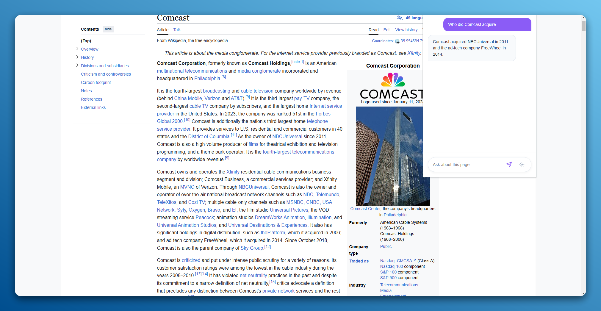
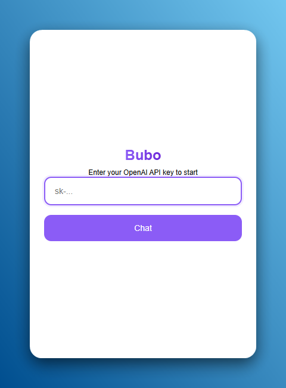
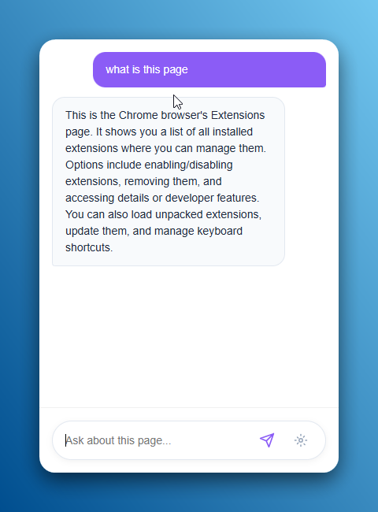

# Bubo AI 🦉

A Chrome extension that allows you to chat with any webpage in your Chrome browser.



## Features ✨

- 📸 Captures screenshot of the current webpage in browser
- 💬 Chat interface to ask questions about the page content
- 🔒 Secure API key storage with encryption
- ⚡ Quick responses using GPT-4o
- 📥 Visual scraping using page JSON data extraction with download capability
- 🔄 Easy API key management

## Installation 🚀


### From Chrome Web Store
1. [Coming soon to Chrome Web Store]

### Local Installation (ZIP Download)
1. Download the ZIP file:
   - Click the green "Code" button on this repository
   - Select "Download ZIP"
   - Extract the ZIP file to a folder on your computer
2. Install in Chrome:
   - Open Chrome and go to `chrome://extensions/`
   - Enable "Developer mode" in the top-right corner
   - Click "Load unpacked"
   - Select the extracted extension folder

### Local Development Installation 

1. Clone this repository:

```bash
git clone https://github.com/yourusername/ai-screenshot-chat.git
```
2. Open Chrome and navigate to `chrome://extensions/`
3. Enable "Developer mode" in the top-right corner
4. Click "Load unpacked" and select the extension directory


## Setup 🔧

1. Get an OpenAI API key from [OpenAI's platform](https://platform.openai.com/)
2. Click the extension icon in your Chrome toolbar 🦉
3. Enter your OpenAI API key when prompted
   


5. Start chatting about any webpage!


   
## Usage 💡

1. Ask anything you want about the contents of webpage including tables, images and text
2. Ask to extract data from the page and summarize into JSON
3. Download JSON

### Example Questions
- "What is the main topic of this article?"
- "Summarize the key points on this page"
- "Extract product information and price as JSON"
- "What are the pricing details shown?"

## Features in Detail 🔍

### Screenshot Capture
- Automatically captures the visible portion of the webpage
- Sends to OpenAI's GPT-4 Vision API for analysis

### Secure API Key Storage
- Encrypted storage using Chrome's storage API
- API key is never exposed in plaintext
- Automatic key rotation for security

### JSON Extraction
- Ask for data in JSON format
- Download extracted data as .json file
- Timestamp-based file naming

## Security 🔐

- API keys are encrypted before storage
- Uses Chrome's secure storage APIs
- No data is stored on external servers

## Privacy Policy 📜

- This extension does not collect any personal data
- All processing happens locally
- Screenshots are only used for AI analysis and sent to OpenAI and are not stored by extension
- No analytics or tracking is implemented

### Prerequisites
- Chrome browser
- OpenAI API key
